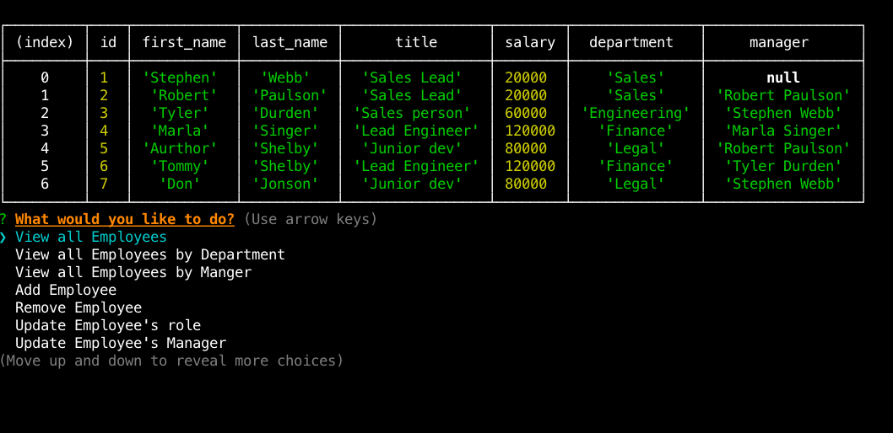

# Employee_Tracker
A solution for managing a company's employees using node, inquirer, and MySQL.
View all of your employess, delete an employee, add an employee, change their manager or their role. All changes are dynamically saved to your database!

## HOW TO USE 

* Fork repository and clone onto your machine
* Make sure you have NODE installed and run the npm install command
* Using the MySQL workbench  Copy and paste the Schema.sql file for the tables and the seed.sql to inject pre set employee information. 
* In the top of the tracker.js file insert your database credentials 
### Type npm start into command line to start  the application

## Technologies used 

* MySQL 
* Javascript
* NODE 
* Inquirer
* Chalk
* console.table

